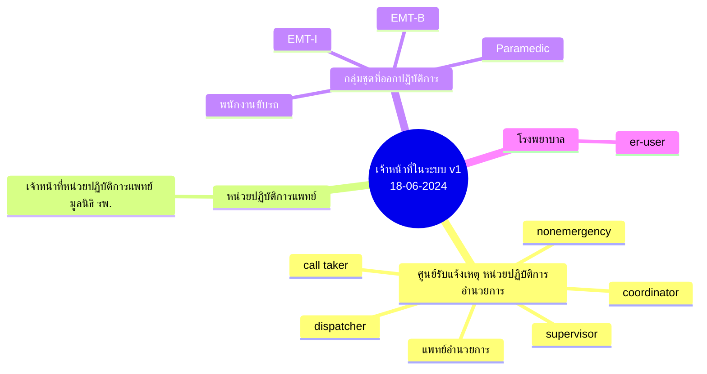
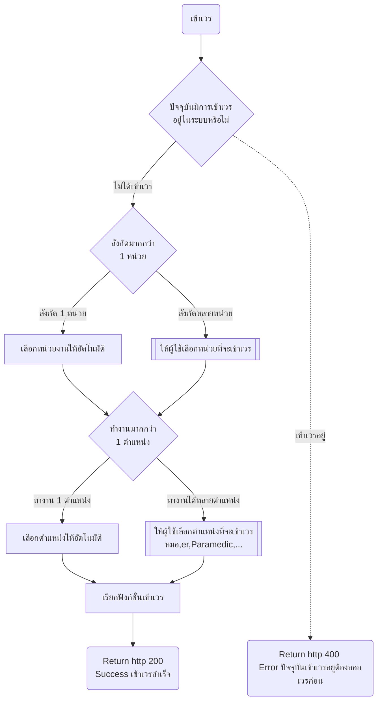
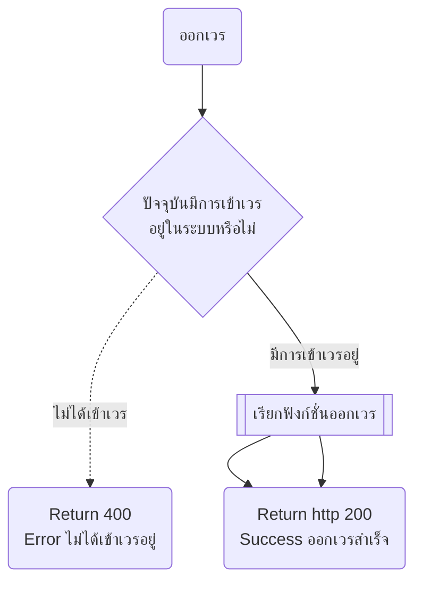

- [เจ้าหน้าที่ในระบบ](#เจ้าหน้าที่ในระบบ)
- [โฟลเข้าเวร](#โฟลเข้าเวร)
- [ออกเวรแบบผู้ใช้เลือก](#ออกเวรแบบผู้ใช้เลือก)
- [ออกเวรอัตโนมัติ](#ออกเวรอัตโนมัติ)
- [HL7 ที่เกี่ยวข้อง ไม่ได้ใช้แล้วให้ outsource รับผิดชอบ](#hl7-ที่เกี่ยวข้อง-ไม่ได้ใช้แล้วให้-outsource-รับผิดชอบ)

## เจ้าหน้าที่ในระบบ

## โฟลเข้าเวร

## ออกเวรแบบผู้ใช้เลือก

## ออกเวรอัตโนมัติ

## HL7 ที่เกี่ยวข้อง ไม่ได้ใช้แล้วให้ outsource รับผิดชอบ
- organization ข้อมูลหน่วยงาน
- practitioner ข้อมูลเจ้าหน้าที่