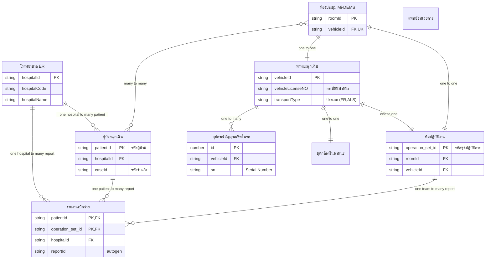
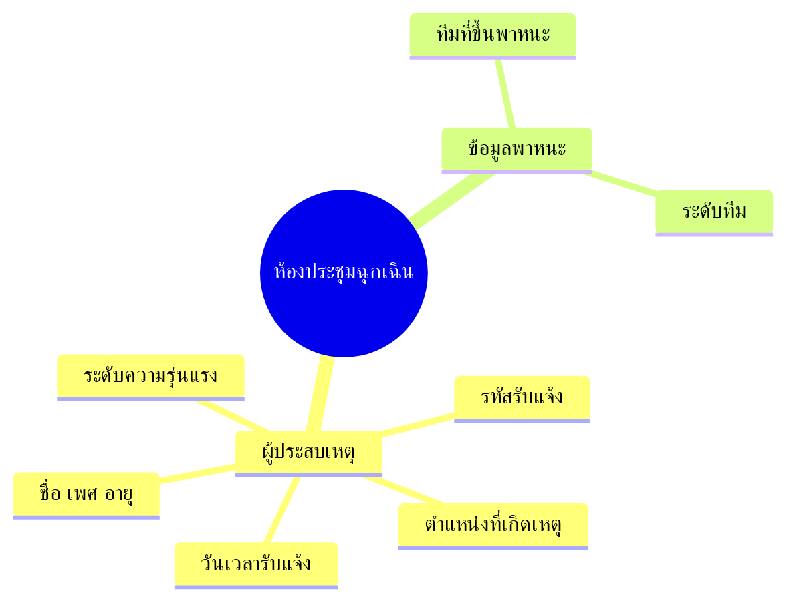
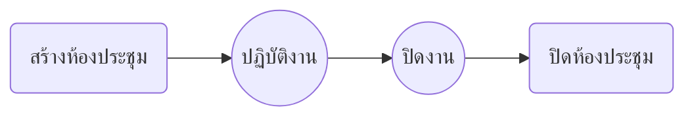

- [Note เอกสารเปิดสำหรับการเชื่อมต่อระบบ](#note-เอกสารเปิดสำหรับการเชื่อมต่อระบบ)
  - [วิเคราะห์ข้อมูล](#วิเคราะห์ข้อมูล)
  - [ข้อมูลสำหรับใช้เปิดห้อง Mi-DEMS](#ข้อมูลสำหรับใช้เปิดห้อง-mi-dems)
    - [ช่วงการเกิดห้องประชุม](#ช่วงการเกิดห้องประชุม)

[api doc](https://lionants02.github.io/Mi-DEMS/)

# Note เอกสารเปิดสำหรับการเชื่อมต่อระบบ

## วิเคราะห์ข้อมูล
ความสัมพันธ์ (Relationships) ของข้อมูล

## ข้อมูลสำหรับใช้เปิดห้อง Mi-DEMS

### ช่วงการเกิดห้องประชุม
